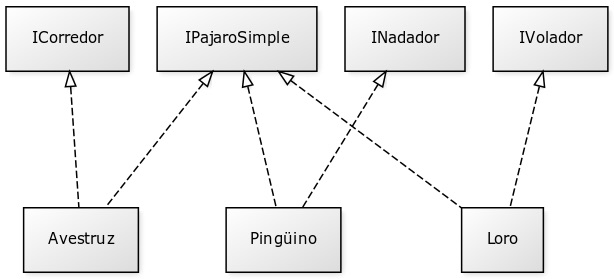
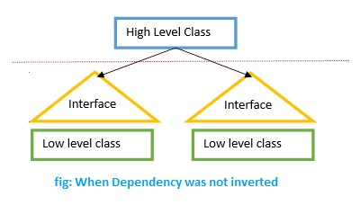
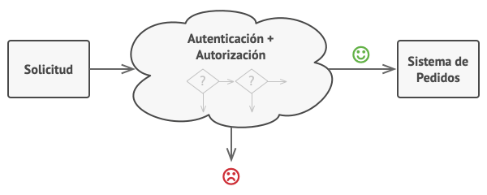
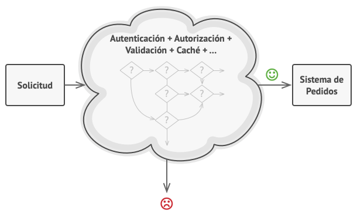
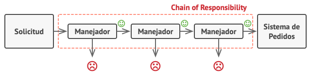

# SOLID

### Single Responsibility Principle
Cada uno tiene su responsabilidad, cada metodo hace algo y tiene una responsabilidad unica

### Open Closed Principle
Se abre por extension y se cierra por modifidacion, se genera una funcion para implementar los metodos que modifican dicho objeto, sin agregarlo como metodo del mismo. Hacemos una generica para todos los tipos de modificaciones que requiere el objeto

### Liskov Substitution Principle
No se le entiende nada al ruso del orto,
Todos los metodos de la super clase seran reemplazadas por la subclase, <br />
Cada clase que hereda de otra puede usarse como su padre sin necesidad de conocer las diferencias entre ellas.

### Interface Segregation Principle
Manejamos un objeto con una interfaz, si tenemos varios aracnidos como arañas, tarantulas y escorpiones tendriamos una interfaz aracnido que tiene las clases araña, tarantula y escorpiones. Tendriamos un problema utilizando el metodo telaaraña, lo implementariamos en todos y le podriamos un panic a escorpion el principio de ISP dice que sólo deberían conocer de éste aquellos métodos que realmente usan, y no aquellos que no necesitan usar, en este caso deberiamos generar una interfaz telaaraña e implementarsela al que lo necesita. Se generan mas interfaces asegurandonos que cada objeto tenga los metodos que realmente utilice<br />


### Dependency Inversion Principle
Los módulos de alto nivel no deberían depender de los módulos de bajo nivel. Ambos deberían depender de abstracciones (p.ej., interfaces).
Las abstracciones no deberían depender de los detalles. Los detalles (implementaciones concretas) deben depender de abstracciones.<br />



# Builder
Extrae el contructor de una clase y le pasa un Builder directamente, sin necesidar de tener varios parametros en la instancia de la clase, se genera un Builder, se van aregando los parametros ahi y luego se le pasa el Builder a la instancia de la clase,
el Builder va a tener bastante codigo complejo ya que va a tener el objetivo de construir todo para el objeto

# Factory
Clase factory que se encarga de crear diferentes tipos de clase en base a algun/os parametro, debemos devolver siempre el puntero (En caso de un struct)
```go
func NewPerson(name string, age int) *Person {
	return &Person{name, age}
}
```

# Prototype
Replicar un diseño de objeto en varios, por ejemplo si tenemos Cars, Iphone, generamos un prototipo para cada uno. Nos permite **clonar** objetos para ser utilizado en otro lado

# Singleton
Componente que tiene sentido tener solo uno en la aplicacion, uno unico, por ejemplo:<br />
- Database repository
- Object FActory
<br />
Tener todo en una sola instancia, prevenit crear copias adicionales esto crearia trabajo adicional a la aplicacion que no tendria sentido<br />
Solo una instancia en toda la aplicacion

# Adapter
Se utiliza para transformar una interfaz en otra, de tal modo que una clase que no pueda utilizar la primera haga uso de ella a través de la segunda.

# Bridge
Previene el producto carteciano. <br />
El patrón Bridge, también conocido como Handle/Body, es una técnica usada en programación para desacoplar una abstracción de su implementación, de manera que ambas puedan ser modificadas independientemente sin necesidad de alterar por ello la otra.<br /><br />
Problema<br />
<br />
Solucion<br />

<br />


# Composite
El patrón Composite sirve para construir objetos complejos a partir de otros más simples y similares entre sí, gracias a la composición recursiva y a una estructura en forma de árbol.<br />
Esto simplifica el tratamiento de los objetos creados, ya que al poseer todos ellos una interfaz común, se tratan todos de la misma manera.<br />
Un claro ejemplo de uso extendido de este patrón se da en los entornos de programación 2D para aplicaciones gráficas. Un videojuego puede contener diferentes capas "layers" de sprites (como una capa de enemigos) pudiéndose invocar un método que actúe sobre toda esta capa de sprites a la vez (por ejemplo, para ocultarlos, darles un filtro de color etc.).<br /><br />
En este caso tenemos Productos y cajas, que a la vez hay cajas mas pequeñas con mas productos, en este caso seria complicado conocer el precio total<br />
<br />
Pero el patron composite nos indica para que trabajems con Productos y Cajas a travez de una interface en comun, que declarara (por ejemplo) el metodo calcular precio<br />


# Decorator
El patrón Decorator responde a la necesidad de añadir dinámicamente funcionalidad a un Objeto. Esto nos permite no tener que crear sucesivas clases que hereden de la primera incorporando la nueva funcionalidad, sino otras que la implementan y se asocian a la primera.<br />
Problema<br/>

<br />Solucion<br/>


# Facade
Fachada (Facade) es un tipo de patrón de diseño estructural. Viene motivado por la necesidad de estructurar un entorno de programación y reducir su complejidad con la división en subsistemas, minimizando las comunicaciones y dependencias entre estos.<br />
Por ejemplo una casa, tiene electricidad, ventilacion, plomeria. <br />
Pasar de un sistema complicado a un set de subsistemas detras de escena

# Flyweight
El patrón Flyweight (u objeto ligero) sirve para eliminar o reducir la redundancia cuando tenemos gran cantidad de objetos que contienen información idéntica, además de lograr un equilibrio entre flexibilidad y rendimiento (uso de recursos).<br />
Ayuda a reducir el consumo de la memoria ram<br />
Por ejempo para usuarios de un juego, muchos se llaman Jonh o Jane, muchos valores repetidos<br />


# Proxy
El patrón Proxy es un patrón estructural que tiene como propósito proporcionar un subrogado o intermediario de un objeto para controlar su acceso.<br />
Un proxy es un contenedor o un objeto de agente que el cliente está llamando para acceder al objeto de servicio real detrás de escena.<br />

<br />Problema<br/>


<br />Solucion<br/>

 <br />

**El proxy genera una interfaz IDENTICA al objeto, el decorator genera una interface MEJORADA al objeto**

# Chain of Responsability
El patrón de diseño o cadena de responsabilidad es un patrón de comportamiento que evita acoplar el emisor de una petición a su receptor dando a más de un objeto la posibilidad de responder a una petición. Para ello, se encadenan los receptores y pasa la petición a través de la cadena hasta que es procesada por algún objeto. Este patrón es utilizado a menudo en el contexto de las interfaces gráficas de usuario donde un objeto puede estar compuesto de varios objetos (que generalmente heredan de una super clase "vista"). No se debe confundir con el patrón Composite (patrón de diseño) que se basa en un concepto similar. Según si el ambiente de ventanas genera eventos, los objetos los manejan o los "pasan" (transmiten) hasta que algún elemento consume dicho evento y se detiene la propagación. Un claro ejemplo de cadena de responsabilidades sería una estructura de datos que contiene nodos cuya implementación es opaca para el usuario de dicha estructura de datos (no conoce salvo la interfaz de la estructura de datos). Internamente los nodos se relacionan mediante punteros y una llamada a un método de la estructura de datos hará que un mensaje se propague por la cadena de nodos hasta llegar a su receptor. Es decir, una petición de "búsqueda(clave)" al contenedor de nodos hará que el mismo pase dicho mensaje a uno de los nodos (raíz, primero, etc; dependiendo de como se haya implementado la estructura de datos) devolviendo el nodo el resultado si su atributo clave coincide con la búsqueda o mandando dicho mensaje al siguiente nodo en caso contrario. Obviamente se daría este caso a niveles teóricos pues existen formas más óptimas de solventar el anterior problema de ejemplo y; sobre todo, ha de tenerse en cuenta que una cadena muy grande de muchos elementos puede llegar a apilar en memoria una gran cantidad de llamadas a procedimientos hasta que la cadena retorne un resultado con su consiguiente coste asociado.<br />

<br />Problema<br/>


<br />Suponete que ahora queremos agregar mas validaciones antes de pasar los datos<br />


<br />Solucion<br/>

 <br />