# Indice
- [Content](#content)
- [Instalacion](#instalacion)
- [Introduccion](#introduccion)
- [Proto](#proto)
- [Protocol Buffers](#protocol-buffers)
- [gRPC Languages](#grpc-anguages)
- [HTTP/2](#http/2)
- [Escalabilidad](#escalabilidad)
- [Errors Code](#errors-code)
- [Deadline](#deadline)

# Content

- Greeting Service
- Calculator Service
- Unary, Server Streaming, Client Streaming, BiDi Streaming
- Error Handling, Deadlines, SSL Encryption
- Blog API CRUD w/ MongoDB
<br />

# Instalacion

```sh
curl -OL https://github.com/google/protobuf/releases/download/v3.13.0/protoc-3.13.0-linux-x86_64.zip
unzip protoc-3.13.0-linux-x86_64.zip -d protoc3
sudo mv protoc3/bin/* /usr/local/bin/
sudo mv protoc3/include/* /usr/local/include/
sudo chown ncostamagna /usr/local/bin/protoc
sudo chown -R ncostamagna /usr/local/include/google
```
```sh
go get -u google.golang.org/grpc

# El instructor lo hace con este
go get -u github.com/golang/protobuf/tree/master/protoc-gen-go

# Yo encontre este
go install google.golang.org/protobuf/cmd/protoc-gen-go
go get google.golang.org/protobuf/cmd/protoc-gen-go \
         google.golang.org/grpc/cmd/protoc-gen-go-grpc

protoc folder/folderpb/file.proto --go_out=plugins=grpc:.


# Como no me funcionaba instale esto
go get google.golang.org/grpc/cmd/protoc-gen-go-grpc
go get -u github.com/golang/protobuf/protoc-gen-go

protoc -I . templatespb/templates.proto --go_out=plugins=grpc:.
```
# Introduccion

gRPC es free y Open-Source desarrollado por Google<br />
Definiremos los Request y Response como RPC (Remote Procedure Calls)<br />
Algunas de las ventajas son que es **moderno, rapido y eficiente**, utiliza **HTTP/2**, tiene **latencia baja, soporta streaming y es independiente del lenguaje**, es facil de utilizar **autentificacion, load balancing, logging y monitoreo**<br /><br/>
El **LIENTE** llamara directamente la funcion del **SEVIDOR**

### Server
```go
func CreateUser(User user){
    // code
}
```

### Client
```go
// code
server.CreateUser(user)
// code
```
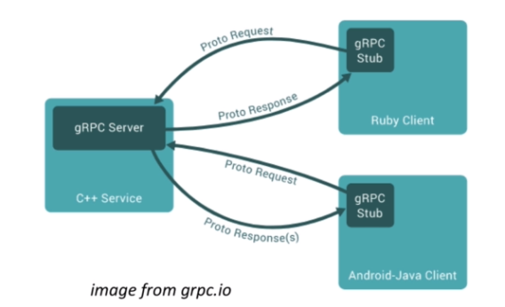

### Extensiones
- proto lint
- vscode-proto3
<br /><br />


# Proto
Necesitamos definir el mensaje y el servicio utilizando **Protocol Buffers**<br />
```proto
syntax = "proto3";

# message -> data, request and response
message Greeting {
    string first_name = 1;
}

message GreetRequest {
    Greeting greeting = 1;
}

message GreetResponse {
    string result = 1;
}

# en el service seria como definir el gRPC endpoint
service GreetService{
    rpc Greet(GreetRequest) returns (GreetResponse) {};
}
```

# Protocol Buffers
Diferencias entre JSON y Protocol Buffer
- JSON: CPU intensive, because the format is human readable
- Pro Buff: is less CPU intensive, mas cerca del codigo maquinal al ser binario<br />
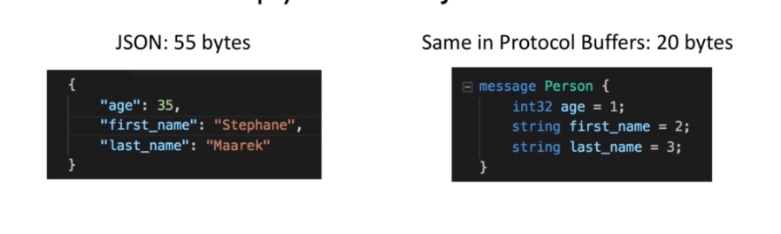<br />
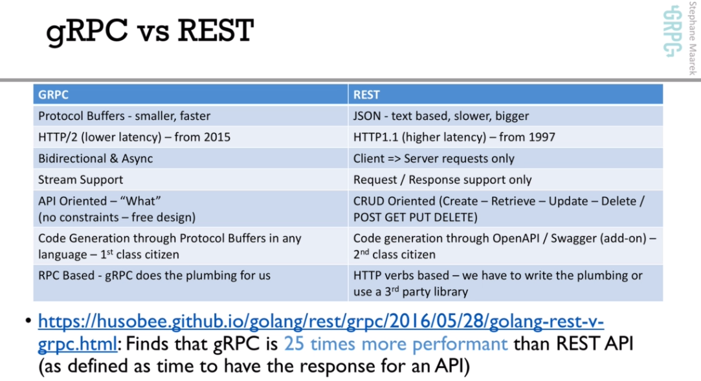
<br />
Porque Protocol Buffer
- Facil de escribir la definicion de mensajes
- La definicion de la API es independiente a la implementacion
- Todo el codigo gordo se genera automaticamente en base a un siemple .proto

# gRPC Languages
Implementaciones de gRPC en los siguientes lenguajes:
- java: puto gRPC en Java
- go: puro gRPC en go
- C: puro gRPQ en C
- C++, Python, Ruby, objective C, PHP, C# y el resto en C <br />
Por mas que tengamos microservicios en diferentes lenguajes podemos comunicarlos igual con gRPC<br />
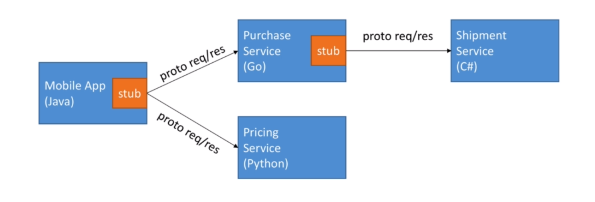

# HTTP/2
diferencias entre http/2 y http/1.1: https://imagekit.io/demo/http2-vs-http1
<br />

**HTTP/1.1**
- Por cada request hace una nueva conexion TCP
- No soporta header compression
- text, muy facil para hacer debugging y ver la data
<br />

<br />

**HTTP/2**
- Mucho mas rapido
- El client y el server pueden pushear mensajes en paralelo por la misma conexion TCP
- Grandioso para reducir latencia
- Server puede pushear streams, multiples mensajes
- Soporta header compression
- Es binario
- Es seguro (SSL no es requerido)
<br />

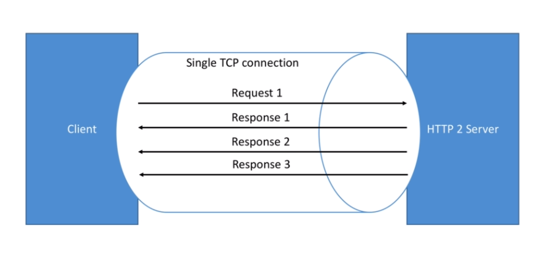<br />

### 4 Types if API in gRPC
- Unary -> traditional API (HTTP REST)<br />
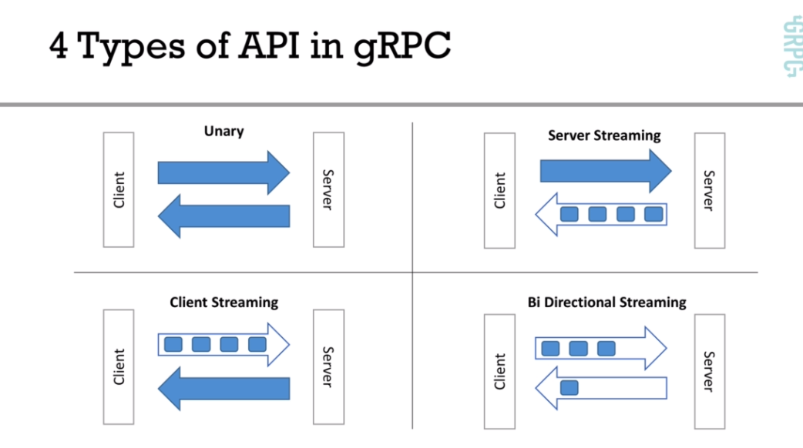<br />
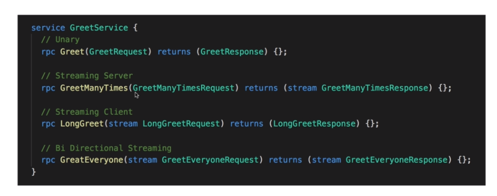<br />
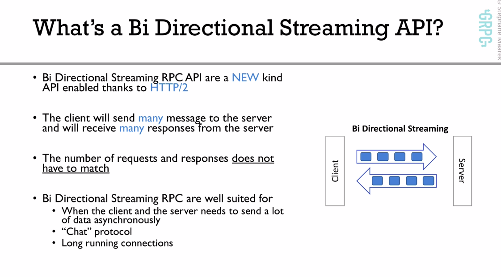


# Escalabilidad
- gRPC server es asincronico por defecto
- No tenemos bloqueos de hilos en los request
- por lo tanto por cada gRPC server podemos servir millones de request en paralelo
- gRPC Client puede ser asincronico o sincronico (bloking)
- gRPC Client puede realizar load balancing

# Errors Code
gRPC maneja un standart de codigos de errores
<br />
documentacion: https://grpc.io/docs/guides/error/
<br />
demo: http://avi.im/grpc-errors/

# Deadline
Es recomendable siempre definir un tiempo de deadline en todos nuestros clients <br />
El server debera chequear si el deadline se excedio y debera cancelar el trabajo que esta haciendo<br />
https://grpc.io/blog/deadlines/
<br />


# Seguridad
TLS (Trasport Layer Security) encrypt conexion entre 2 endpoints <br />
ejemplo: https://grpc.io/docs/guides/auth/
<br />


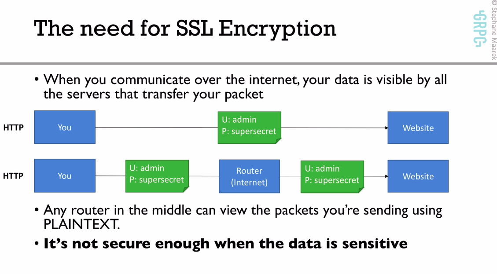 <br />
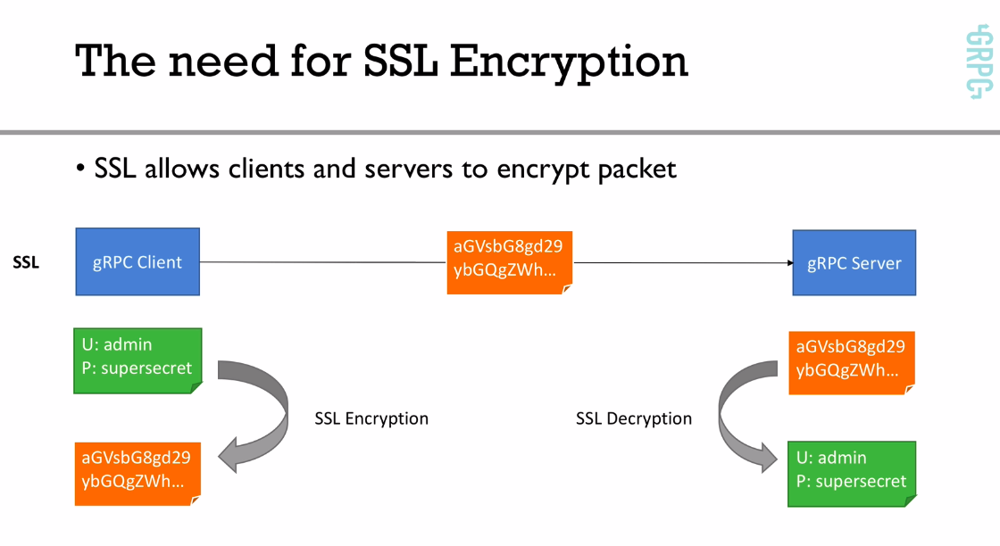 <br />
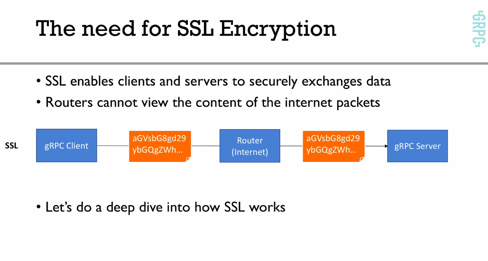 <br />
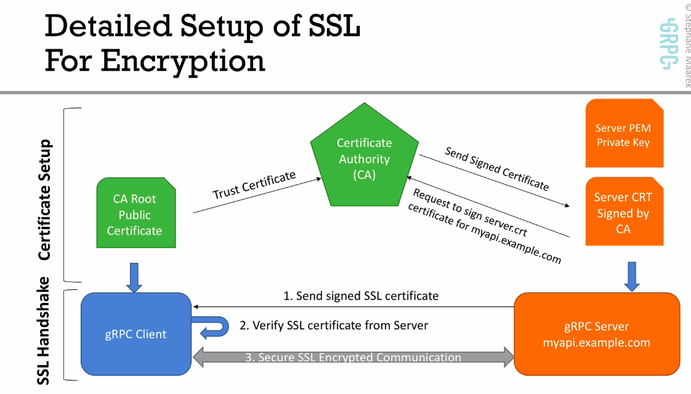
<br />

Lo que hizo este pelotudo no funciona, despues googlear, parece que esta manera de certificar quedo deprecada <br />
https://github.com/grpc/grpc-go/tree/master/examples/data
```sh
#!/bin/bash
# Inspired from: https://github.com/grpc/grpc-java/tree/master/examples#generating-self-signed-certificates-for-use-with-grpc

# Output files
# ca.key: Certificate Authority private key file (this shouldn't be shared in real-life)
# ca.crt: Certificate Authority trust certificate (this should be shared with users in real-life)
# server.key: Server private key, password protected (this shouldn't be shared)
# server.csr: Server certificate signing request (this should be shared with the CA owner)
# server.crt: Server certificate signed by the CA (this would be sent back by the CA owner) - keep on server
# server.pem: Conversion of server.key into a format gRPC likes (this shouldn't be shared)

# Summary 
# Private files: ca.key, server.key, server.pem, server.crt
# "Share" files: ca.crt (needed by the client), server.csr (needed by the CA)

# Changes these CN's to match your hosts in your environment if needed.
# certifico en base al host
SERVER_CN=localhost
#SERVER_CN=myapi.example.com

# Step 1: Generate Certificate Authority + Trust Certificate (ca.crt)
openssl genrsa -passout pass:1111 -des3 -out ca.key 4096
#Este es el archivo que vamos a usar en el client (ca.crt)
openssl req -passin pass:1111 -new -x509 -days 3650 -key ca.key -out ca.crt -subj "/CN=${SERVER_CN}"

# Step 2: Generate the Server Private Key (server.key)
openssl genrsa -passout pass:1111 -des3 -out server.key 4096

# Step 3: Get a certificate signing request from the CA (server.csr)
openssl req -passin pass:1111 -new -key server.key -out server.csr -subj "/CN=${SERVER_CN}"

# Step 4: Sign the certificate with the CA we created (it's called self signing) - server.crt
openssl x509 -req -passin pass:1111 -days 3650 -in server.csr -CA ca.crt -CAkey ca.key -set_serial 01 -out server.crt 

# Step 5: Convert the server certificate to .pem format (server.pem) - usable by gRPC
openssl pkcs8 -topk8 -nocrypt -passin pass:1111 -in server.key -out server.pem
```

Con esto funciono

```sh
PASSWORD=grpc
if [ $# -ge 1 ]
  then
    PASSWORD=$1
fi

cat <<EOT >>dev.config
[ req ]
default_bits       = 2048
default_md         = sha256
default_keyfile    = dev.key
prompt             = no
encrypt_key        = no

distinguished_name = dn
req_extensions     = v3_req
x509_extensions    = x509_req
string_mask        = utf8only

[ dn ]
commonName             = localhost dev cert
emailAddress           = test@localtest.me
countryName            = US
stateOrProvinceName    = DE
localityName           = Wilmington
organizationName       = Todo World

[ x509_req ]
subjectKeyIdentifier   = hash
authorityKeyIdentifier = keyid,issuer
basicConstraints       = critical, CA:false
keyUsage               = critical, keyEncipherment
subjectAltName         = @alt_names
# extendedKeyUsage  = serverAuth, clientAuth
nsComment              = "OpenSSL Generated Certificate"

[ v3_req ]
subjectKeyIdentifier   = hash
basicConstraints       = critical, CA:false
subjectAltName         = @alt_names
# extendedKeyUsage  = serverAuth, clientAuth
nsComment              = "OpenSSL Generated Certificate"

[ alt_names ]
DNS.1                  = localhost
EOT

openssl req -config dev.config -new -out dev.csr.pem
openssl x509 -req -days 365 -extfile dev.config -extensions v3_req -in dev.csr.pem -signkey dev.key -out dev.crt
openssl pkcs12 -export -out dev.pfx -inkey dev.key -in dev.crt -password pass:$PASSWORD
rm dev.config dev.csr.pem
# cp dev.pfx ../MyApp

```
<br />
https://docs.servicestack.net/grpc-ssl

# Reflection
Nos sirve para utilizar un client directamente sin necesidad de desarrollarlo para ver como funciona el server con las diferentes comunicaciones <br />
lo agregamos en calculator <br />
https://github.com/grpc/grpc-go/tree/master/reflection

```go
import "google.golang.org/grpc/reflection"

s := grpc.NewServer()
pb.RegisterYourOwnServer(s, &server{})

// Register reflection service on gRPC server.
reflection.Register(s)

s.Serve(lis)
```

<br />

El siguiente paso es uinstalar evans
<br />
https://github.com/ktr0731/evans

<br />

```sh
evans -p 50051 -r
# Entramos a evans

show package
show service
show message

desc SumRequest # descripcion

package default # usamos el default
service calculator
call Sum
```

# Final

pubsub: https://github.com/googleapis/googleapis/blob/master/google/pubsub/v1/pubsub.proto
<br />
spanner: https://github.com/googleapis/googleapis/blob/master/google/spanner/v1/spanner.proto
<br />
Alternativa de como implementar gRPC y PB: https://github.com/gogo/protobuf