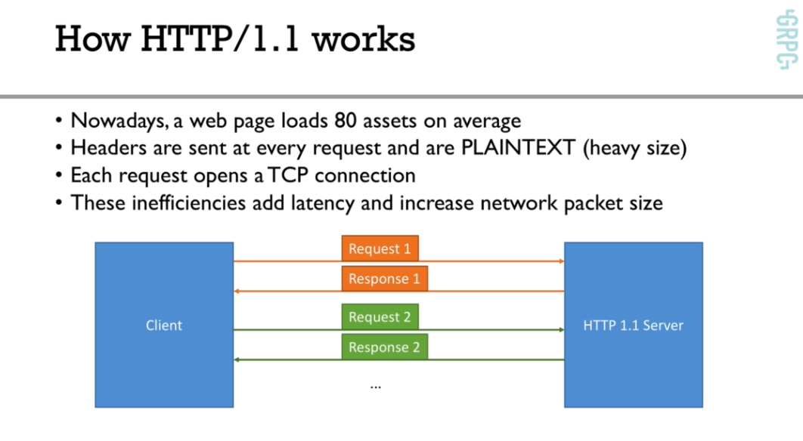

# Grpc Golang Course

This is a companion repository for my [GRPC Golang course](http://bit.ly/grpc-golang-github)

[](http://bit.ly/grpc-golang-github)

<br />
Sitio oficial: https://grpc.io/

# Content

- Greeting Service
- Calculator Service
- Unary, Server Streaming, Client Streaming, BiDi Streaming
- Error Handling, Deadlines, SSL Encryption
- Blog API CRUD w/ MongoDB
<br />


# Introduccion

gRPC es free y Open-Source desarrollado por Google<br />
Definiremos los Request y Response como RPC (Remote Procedure Calls)<br />
Algunas de las ventajas son que es **moderno, rapido y eficiente**, utiliza **HTTP/2**, tiene **latencia baja, soporta streaming y es independiente del lenguaje**, es facil de utilizar **autentificacion, load balancing, logging y monitoreo**<br /><br/>
El **LIENTE** llamara directamente la funcion del **SEVIDOR**

### Server
```go
func CreateUser(User user){
    // code
}
```

### Client
```go
// code
server.CreateUser(user)
// code
```


### Extensiones
- proto lint
- vscode-proto3
<br /><br />


# Proto
Necesitamos definir el mensaje y el servicio utilizando **Protocol Buffers**<br />
```proto
syntax = "proto3";

# message -> data, request and response
message Greeting {
    string first_name = 1;
}

message GreetRequest {
    Greeting greeting = 1;
}

message GreetResponse {
    string result = 1;
}

# en el service seria como definir el gRPC endpoint
service GreetService{
    rpc Greet(GreetRequest) returns (GreetResponse) {};
}
```

# Protocol Buffers
Diferencias entre JSON y Protocol Buffer
IMAGEN
- JSON: CPU intensive, because the format is human readable
- Pro Buff: is less CPU intensive, mas cerca del codigo maquinal al ser binario<br />

<br />
Porque Protocol Buffer
- Facil de escribir la definicion de mensajes
- La definicion de la API es independiente a la implementacion
- Todo el codigo gordo se genera automaticamente en base a un siemple .proto

# gRPC Languages
Implementaciones de gRPC en los siguientes lenguajes:
- java: puto gRPC en Java
- go: puro gRPC en go
- C: puto gRPQ en C
- C++, Python, Ruby, objective C, PHP, C# y el resto en C <br />
Por mas que tengamos microservicios en diferentes lenguajes podemos comunicarlos igual con gRPC<br />


# HTTP/2
diferencias entre http/2 y http/1.1: https://imagekit.io/demo/http2-vs-http1
<br />

**HTTP/1.1**
- Por cada request hace una nueva conexion TCP
- No soporta header compression
- text, muy facil para hacer debugging y ver la data
<br />

<br />

**HTTP/2**
- Mucho mas rapido
- El client y el server pueden pushear mensajes en paralelo por la misma conexion TCP
- Grandioso para reducir latencia
- Server puede pushear streams, multiples mensajes
- Soporta header compression
- Es binario
- Es seguro (SSL no es requerido)
<br />

<br />