# Multithreading In Go

Multi-threading examples, including a boids simulation in Go Lang

The udemy course for this repo can be found at:
https://www.udemy.com/course/multithreading-in-go-lang/?referralCode=D20A3CBD00E90DB2ABF8

This source code has examples of creating threads and inter process communication (IPC) via
memory sharing and message passing (such as channels). It also has examples of thread 
synchronization, such as mutexes, wait groups and conditional variables.

This project uses Ebiten, A dead simple 2D game library in Go for the boids examples.
https://github.com/hajimehoshi/ebiten  
Found the library is very easy to install and use. Check out some of the games bundled with the lib.

To run any of the code examples/scenarios do the following:
```
cd <goprojects>/multithreadingingo
go build ./...
go run ./<example>
```
such as:
```
go run ./boids
```

Please do get in touch if you have any suggestions/improvements!

Follow me on https://twitter.com/cutajarj

And checkout my blog at: www.cutajarjames.com

This is an owl in a tree and has nothing to do with this project, but I think it's pretty cool:

```
   ...    *    .   _  .   
*  .  *     .   * (_)   *
  .      |*  ..   *   ..
   .  * \|  *  ___  . . *
*   \/   |/ \/{o,o}     .
  _\_\   |  / /)  )* _/_ *
      \ \| /,--"-"---  ..
_-----`  |(,__,__/__/_ .
       \ ||      ..
        ||| .            *
        |||
ejm98   |||
  , -=-~' .-^- _
```

sudo apt-get install -y libgl1-mesa-dev
sudo apt-get install -y libxcursor-dev
libxinerama-dev
sudo apt-get install libxcursor-dev libxrandr-dev libxinerama-dev libxi-dev

# Multithreads

### Process
Funcion fork para identificar un nuevo proceso

```go
if fork() == 0 {
  fmt.Println("I am the new process") //child
} else {
  fmt.Println("I am the old process") //parent
}

```

### Thread
Mismo espacio de memoria, no lo duplica como los process, consume menos memoria y es mas rapido, kernel level

### Green Thread
Mas eficiente que los threads cotidianos, en los anteriores el sistema se encarga de seleccionar el siguiente step o proceso (context switch), lo que demora tiempo.<br />
Los **Green Thread** nos ayudan a reducir ese tiempo, son mas rapidos, user level, no necesita del context switch.<br />
**Desventajas**: cuando necesita utilizar funcionalidades del sistema operativo como leer un archivo y tiene que esperar<br />
Golang nos permite utilizar automaticamente un mix entre ambos
<br />


# Comunicacion entre procesos

## Pasar un mensaje
Mandar un mensaje y recibir otro

## Memoria compartida
Comparten memoria y pueden obtener valores particulares compartidos entre los threads<br />
Facil y eficiente

## Synchronization with Mutexes

Con las funcionalidades de **Lock y Unlock** me permite bloquear y desbloquear variables para que no sean pisadas por otro thread, y asi no haya inconsistencia

#### Inconsistencia
```go
var money = 100

func stingy() {
	for i := 1; i <= 1000; i++ {
		money += 10
		time.Sleep(1 * time.Millisecond)
	}
	println("Stingy Done")
}

func spendy() {
	for i := 1; i <= 1000; i++ {
		money -= 10
		time.Sleep(1 * time.Millisecond)
	}
	println("Spendy Done")
}
```

#### Con Mutex
```go
var (
	money = 100
	lock  = sync.Mutex{}
)

func stingy() {
	for i := 1; i <= 1000; i++ {
		lock.Lock()
		money += 10
		lock.Unlock()
		time.Sleep(1 * time.Millisecond)
	}
	println("Stingy Done")
}

func spendy() {
	for i := 1; i <= 1000; i++ {
		lock.Lock()
		money -= 10
		lock.Unlock()
		time.Sleep(1 * time.Millisecond)
	}
	println("Spendy Done")
}
```

POdemos setear y definir por lectura y/o escritura, para no sobrecargar los threads

```go
	lock  = sync.RWMutex{}

	// Lectura
	lock.RLock()
	lock.Runlock()

	// Writer
	lock.Lock()
	lock.Unlock()
```

# Wait Groups
Podemos hacer agrupaciones de thread para que vayan esperando y se vayan ejecutando de a grupos, algo parecido a las colas.<br />
El main thread se bloquea, va ejecutando los wait group y cuando este es cero se desbloquea el main thread

```go
Add(int) //aregar nuevo thread
Wait() // espera hasta que los hijos terminen
Done() //finaliza operacion

```
 <br />
 <br />
ejemplo en **filesearch**

# Channels
El problema con la memoria compartida es que no se bloque alguna parte de la memoria,
**message passing** es otra opcion para la comunicacion entre threads.<br />
<br />
El mensaje solo lo consume uno y lo produce otro, no tenemos el problema de bloqueos pero no es tan flexible como el de memoria compartida, si quisieramos mandar mensajes a 100 diferentes threads seria mas dificil<br />
Ejemplos en **channels** y **threadpoll**


# Condition Variable
Nos proporciona funcionalidades mas avanzadas, ejemplo en **condvariables** <br />
Puedo bloquear y mandar mensajes <br/>
https://kaviraj.me/understanding-condition-variable-in-go/

# Dead Locks 
Cuando los recursos quedan bloqueados infinitamente
<br />
<br />
<br />
Un ejemplo<br />
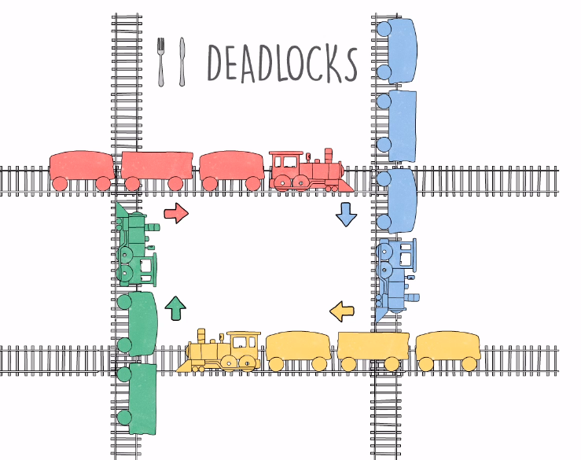<br />
UN ejemplo de bloqueos de threads en **deadlocks_simple**<br />
### Resource Hierarchy
Colocando valores numericos a cada thread, utilizandolos desde el menos hacia el mayor y luego voy de mayor a menor<br />
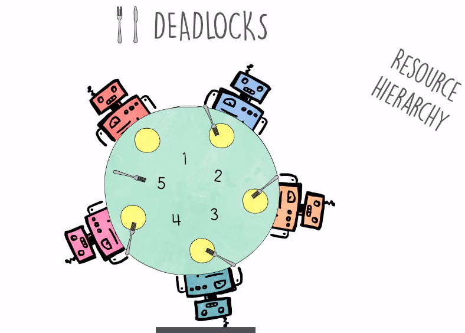<br />
Con los trenes, cuando va a pasar el rojo bloquea al azul, haciendo que el mismo no lo interrumpa, pero esto puede generar bloqueos si se hacen al mismo tiempo<br />
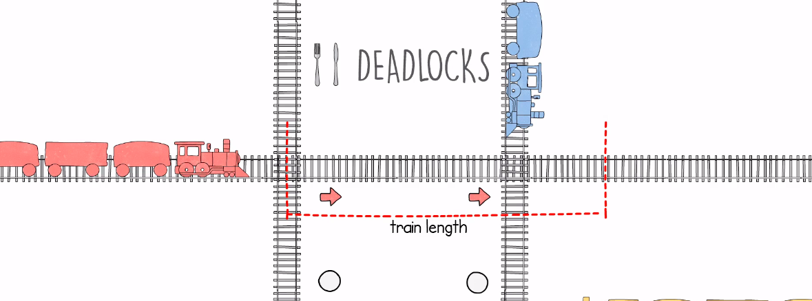<br />
La solucion es generar valores numericos, en este caso, para que el verde inice (4) necesita que el rojo (1) se desbloque<br />
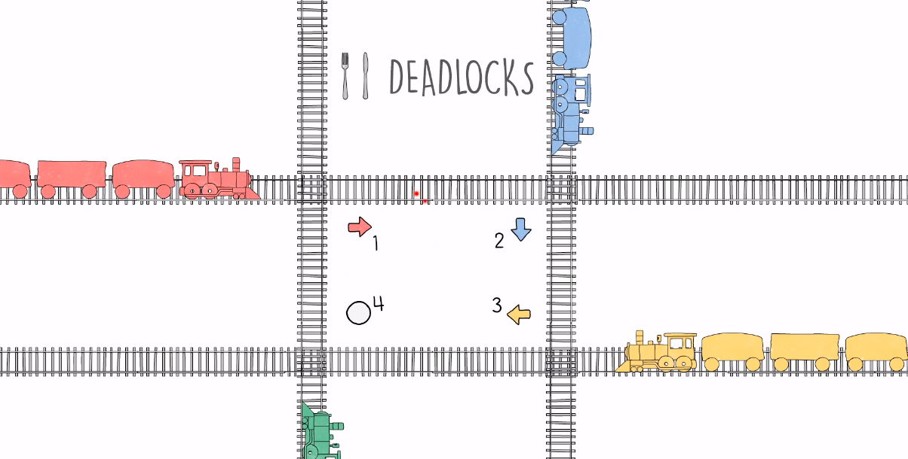<br />
Entonces lo toma el amarillo y avanza<br />
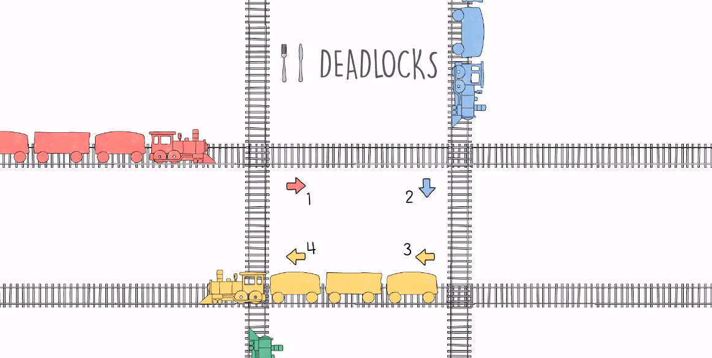<br />
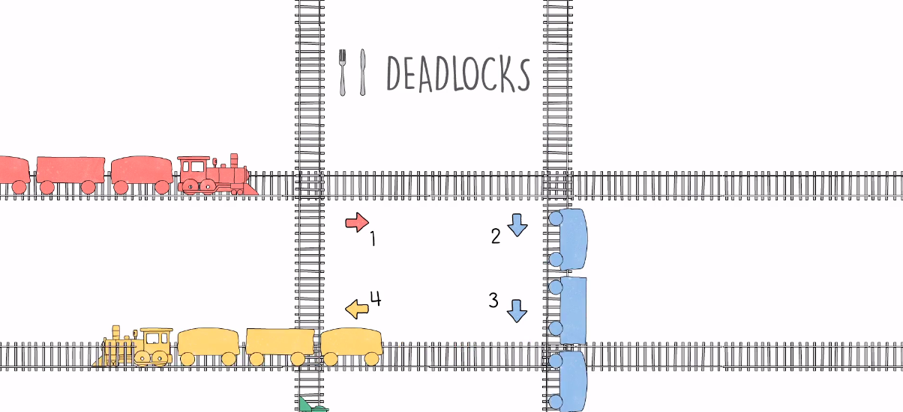<br />
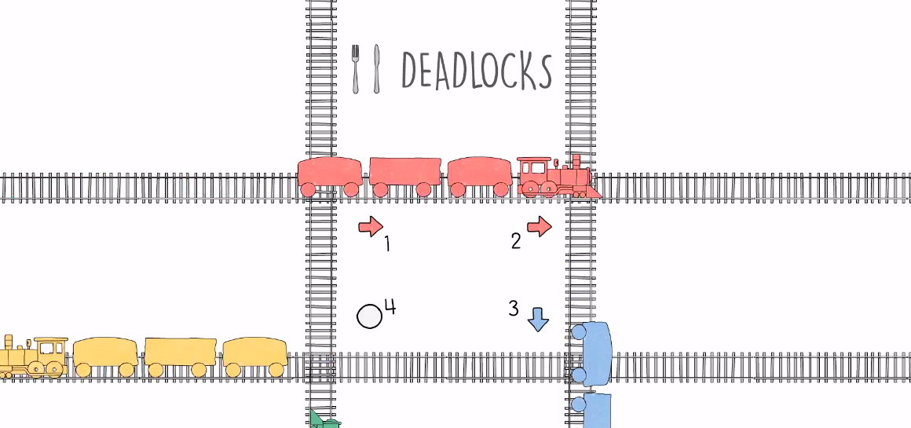<br />
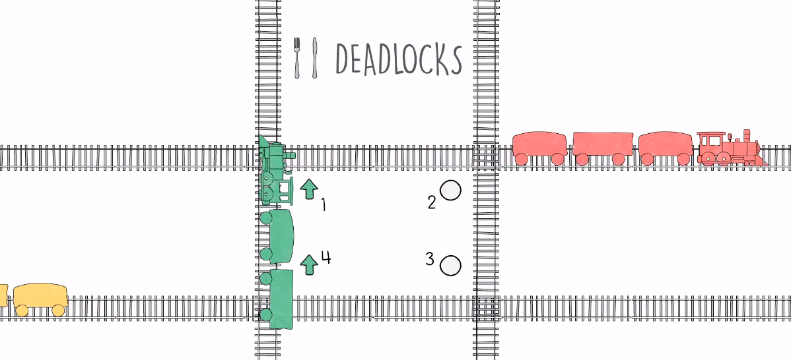<br />

### Arbitrator
El arbitrator va a ser quien va a decidir que thread utilizara el recurso<br />
<br />
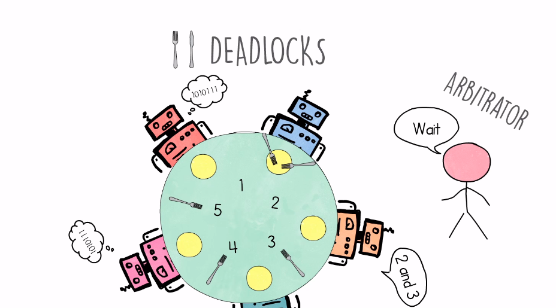<br />
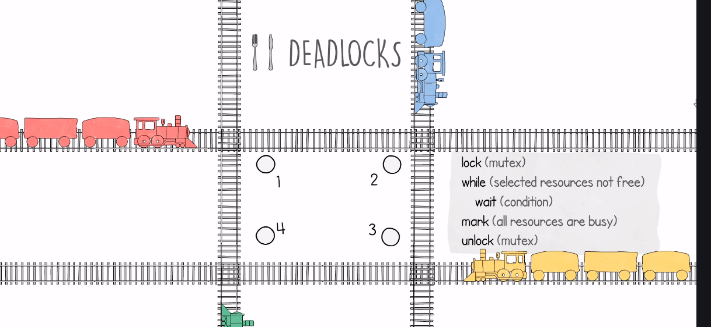<br />
quiere pasar el azul<br />
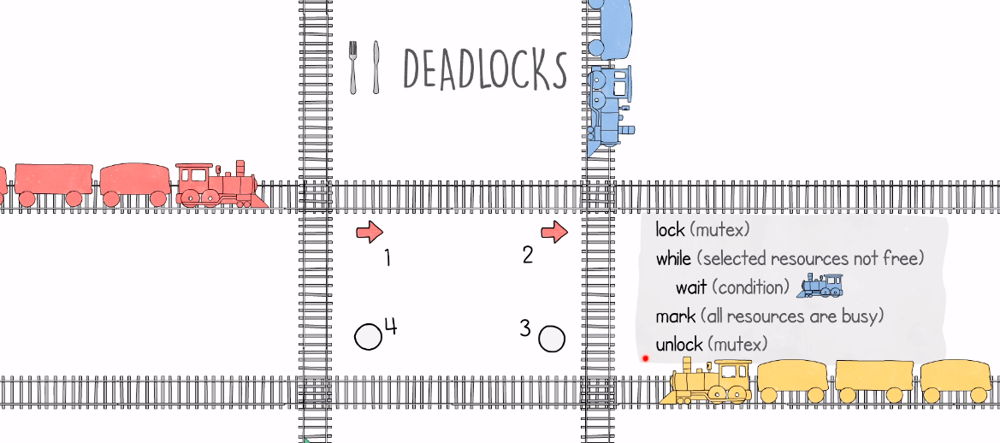<br />
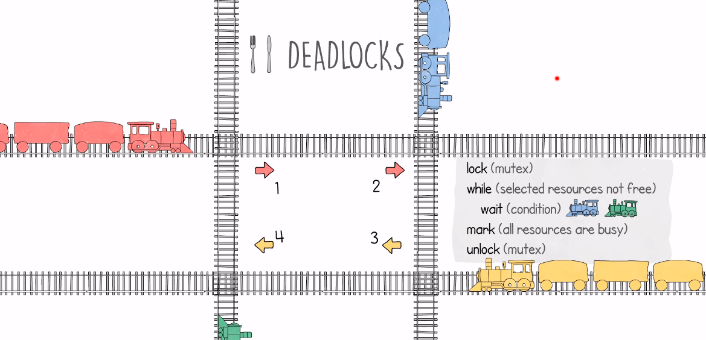<br />
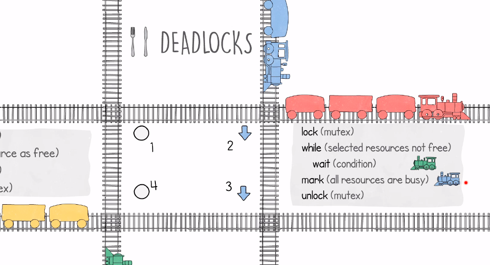<br />
Luego pasa a unlock<br />
