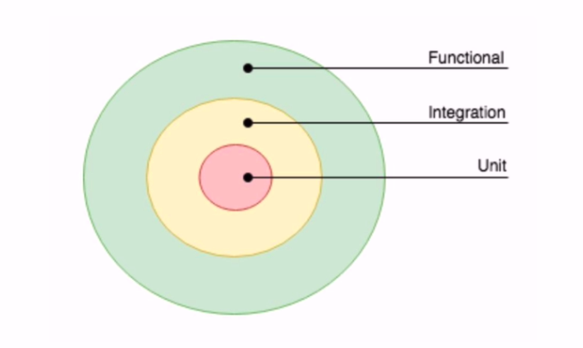
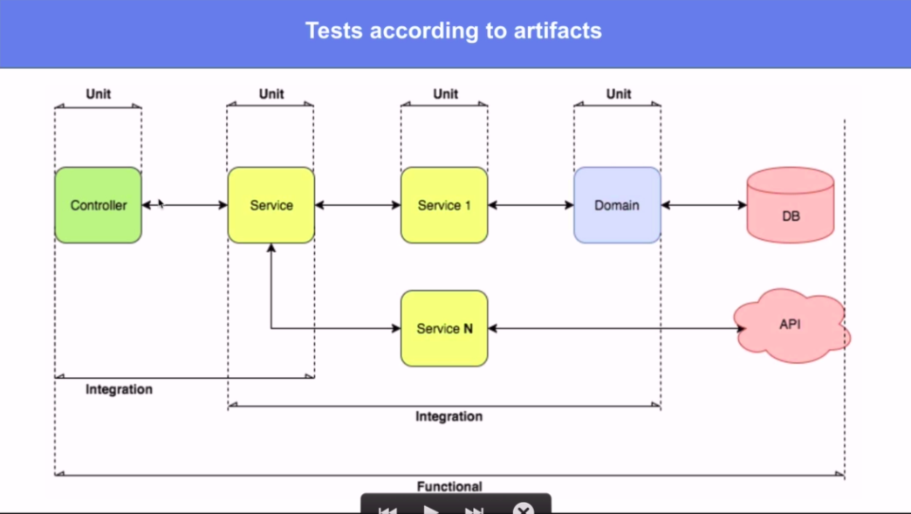
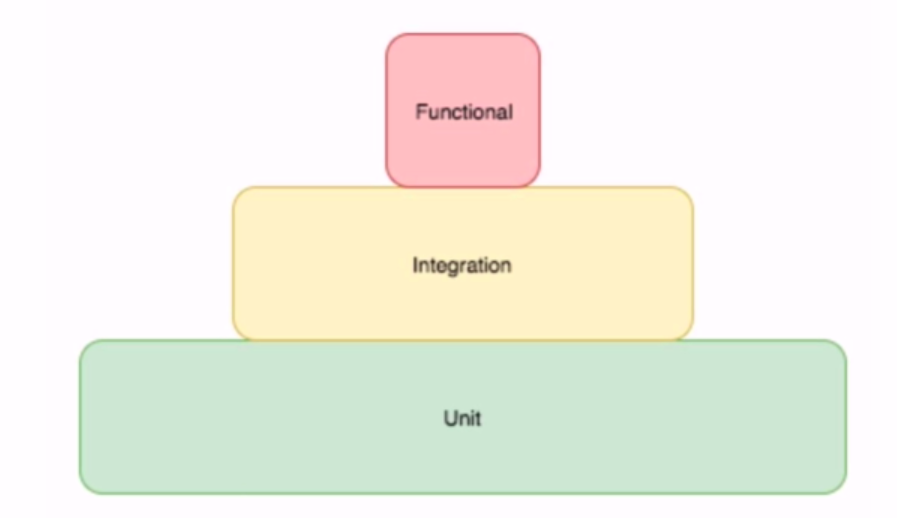

# Indice
- [Introduccion](#introduccion)
- [Instalaciones](#instalaciones)
- [Go Fundamentos](#go-fundamentos)
- [Variables](#variables)
- [Funciones](#funciones)
- [Vectores](#vectores)
- [Interfaces](#interfaces)
- [Recursion](#recursion)
- [Asincronismo](#asincronismo)
- [Punteros](#punteros)
- [Base de datos](#base-de-datos)
- [Packages](#packages)
- [Logger](#logger)
- [Importacion de paquetes locales](#importacion-de-paquetes-locales)
- [Crear Package](#crear-package)
- [Test](#test)

<br />

# Introduccion

### Que es Go?
se le llama Golang tambien, cuando uno pone Go en Google aparecen mil cosas, lenguaje de google. Resolver problemas internos de google, necesitaba algo con mucha velocidad parecido a c++<br />
Lenguaje fuertemente tipado, pensado para aprovechar los ultimos avances en hardearem multiprocesadores,
 enorme cantidad de memoria y paralelismo. Aprovecha mucho el paralelismo<br />
Lenguaje compilado, genera un biranio.<br />
Obliga al desarrollador a realizar buenas practicas<br />
**Lenguaje ideal para desarrollos grandes con miles y miles de usuarios**<br />
- Facil de entender y claro
- Traducido a c++
- Las funciones de Go pueden devolver mas de un valor
- Se pueden desarrollar instrucciones Sync como Async
- Programacion Async mas clara que NodeJS (Promesas)
- Solo existe **for** para interacciones (No existe while)
- NO ES ORIENTADO A OBJETOS
- Scope se resuelve con el nombre de las variables, metodos o funciones
   - Si empieza con minuscula es privada
   - Si empieza con mayuscula se exporta a otro scope


<br />

# Instalaciones

Instalamos Go de https://golang.org/ <br />

Instalamos la extension **Go, Go Outliner, vscode-proto3, Clang-Format y Go Autotest (chequeando nuestro programa)** de visual studio code <br />
**Kite Autocomplete Plugin Python** es para Python pero nos sirve para Go<br />

<br />
Siempre que clono un proyecto de github debo crear las carpetas a partir de el src 
donde tengo mi GOPATH,
si bajo un projecto que es gitlab.com/ncostamagna/sarasa deberia guardarlo en:<br />
**${GOPATH}/src/gitlab.com/ncostamagna/sarasa**
 
```sh
GOPATH
   /src
      gitlab.com
         username
            repo
      github.com
         username
            repo
```
Las variables de entorno se deben configurar de la siguientem manera

```sh
GOROOT=/usr/local/go # Donde esta instalado go
GOPATH=/home/nahuel/project # Donde estan mis proyectos
PATH=${GOROOT}/bin:${PATH}
```

# Go Fundamentos

Ejecuciones para correr el programa

```sh
# Corremos el archivo main, lo compila en memoria y lo ejecuta
go run main.go 

go build main.go # Genero el ejecutable
```

# Variables
Se inicializan en cero, blanco o false<br />
Si no uso las variables el programa no corre
```go
var numero2 int

// toma el tipo de datos del valor que le asigno
// se crean nuevas variables automaticamente
numero6, numero7, numero8, numero9 := 4, 12, 5, "Texto"

numero2 = int("2") // convierto a 2 entero
texto = fmt.Sprintf("%d", numero)

// tambien podemos declarar constantes
const pi float64 = 3.14159265359
```
Hay una libreria para convertir que se llama **strconv**<br />

# Funciones
Todo con funciones, no existen metodos (son funciones en si misma)<br />
Alojamos un dato en **_** cuando no vamos a usarlo<br />
```go
// funcion getStockPriceChange
// params (prevPrice, currentPrice float64)
// retorna (float64, float64)
func getStockPriceChange(prevPrice, currentPrice float64) (float64, float64) {
	change := currentPrice - prevPrice
	percentChange := (change / prevPrice) * 100
	return change, percentChange
}
```
```go
// generamos un metodo reset para poly
type poly struct {
    coeffs [256]uint16
}

func (p *poly) reset() {
    for i := range p.coeffs {
        p.coeffs[i] = 0
    }
}

var p poly
p.reset()
```
https://stackoverflow.com/questions/31561369/how-do-i-declare-a-function-pointer-to-a-method-in-go

```go
package main

import (
	"fmt"
	"math"
)

type Vertex struct {
	X, Y float64
}

// el valor X no va a ser afectado fuera de la funcion
func (v Vertex) Abs() float64 {
	v.X = 6
	fmt.Println(v.X)
	return math.Sqrt(v.X*v.X + v.Y*v.Y)
}

// el valor X sera afectado fuera de la funcion
func (v *Vertex) Scale(f float64) {
   v.X = 5
	fmt.Println(v.X)
}

func main() {
	v := Vertex{3, 4}
	v.Scale(10)
	fmt.Println(v.X)
	fmt.Println(v.Abs())
	fmt.Println(v.X)
}


// utilizo el puntero de usuario, lo que modifique aca
// se va a ver reflejado afuera
func (user *User) Get() rest_errors.RestErr {
   stmt, err := users_db.Client.Prepare(queryGetUser)
}

// Es una copia de usuario, lo que modifique aca no se va a 
// ver reflejado afuera
func (user User) Get() rest_errors.RestErr {
   stmt, err := users_db.Client.Prepare(queryGetUser)
}
```

### Scope
It’s worth to mention that assigning new value to variable doesn’t affect scoping (aka visibility):
```go
v := 1
{
    v = 2  // assignment
    fmt.Println(v)
}
fmt.Println(v)
```
```sh
# Outputs
>./bin/sandbox
2
2
```

```go
v := 1
{
    v := 2  // short variable declaration
    fmt.Println(v)
}
fmt.Println(v)
```
```sh
# Outputs
>./bin/sandbox
2
1
```
# Vectores

**slice**: Vectores dinamicos, puedo ampiar la dimension en tiempo de ejecucion
```go
var vector [5]int // vector, no puedo ampliar mas
var vector_slice []int //slice, puedo apliar dinamicamente
elementos[3:] //de la posicion 3 hasta el ultimo, igual que python

elementos := make(tipo,largo,capacidad maxima)
len(elementos) //tamaño
cap(elementos) //capacidad
```
# Interfaces
Nos ayudan a definir comportamientos, operaciones y conductas<br />
Se definen los metodos que vamos autilizar para implementar esa interface<br />
Implementar el mismo comportamiento a objetos que no tienen relacion entre si<br />
```go
type serVivo interface{
  edad() int
}

type humano interface{
  pensar()
  edad() int
}

type animal interface{
  comer()
  edad() int
}
```

# Recursion
Funcion que se llama a si misma

# Asincronismo
De la siguiente manera ejecutamos una funcion en otro hilo, con una **GoRutine**
```go
go nombreLentooo("Nahuel Costamagna")
```
Go no se queda esperando hasta que termine<br />
**Channels**: canales que permiten enviar informacion hacia otra go rutine, es un espacio
de memoria de dialogo en el que van a dialogar distintas rutinas<br />

```go
// con las flechitas podemos obtener el valor de algun hilo

timeoutChan := make(chan bool, 1)
defer close(timeoutChan)
   
go func() {
   BubbleSort(elements)
   timeoutChan <- false // asignamos false
}()

// agregamos timeout en otro hilo
go func() {
   time.Sleep(1000 * time.Millisecond)
   timeoutChan <- true //asignamos false
}()

// validamos lo primero que recibimos
// si recibimos false termino bien el ordenamiento, sino termino primero el sleep
if <-timeoutChan {
   assert.Fail(t, "bubble sort took more than 1000 ms")
   return
}

```
# Punteros
Direccion de memoria, en lugar del valor obtenemos la direccion donde esta el valor, nos sirve para 
modificar el mismo dato en diferentes partes del codigo<br />
Para definir un puntero utilizamos *<br />
Para extraer la direccion de memoria utilizamos &
```go
var x,y *int
entero := 5
x = &entero // accede a la direccion de memoria
y = &entero

*x = 20

// ahora al imprimir entero, x o y me va a devolver 20
```


# Base de datos

### Mongo

```go
/*
   con formato indicamos
   bson: el nombre del campo en la base de datos, datos entrada
         a la base
   omitempty: si viene vacio lo omite
   json: me lo va a devolver como id, datos de salida
*/
type Usuario struct {
//nombre          tipo dato          formato      
	ID              primitive.ObjectID `bson:"_id,omitempty" json:"id"`
	Nombre          string             `bson:"nombre" json:"nombre,omitempty"`
	Apellidos       string             `bson:"apellidos" json:"apellidos,omitempty"`
}
```


# Packages

Analizar si el go module es compatible
```sh
go list -m -version github.com/dgrijalva/jwt-go
```
Si me aparece +incopatible es que es incompatible :p<br />
Significa que la dependencia tiene un **semver major** de 2 o superior y no es un modulo de Go todavia, <br />
No tiene un mod.go en el codigo <br />
**v4.5.1**
- 4 -> Major
- 5 -> Minor
- 1 -> Patch


#### context
no existen variables globales, dentro del llamado de una api Go creo un contexto, es un 
espacio en memoria donde voy a ir compartiendo cosas, nos sirven para comunicar informacion 

#### log
para generar logs, nos conviene utilizar **log.Println()**, esta bueno porque nos muestra la fecha y hora al costado de cada linea

#### gin-gonic
HTTP web framework, buena performace
```sh
go get -u github.com/gin-gonic/gin
```
Tambien podriamos usar gorilla mux, pero en mux tenemos que desarrollar los benchmarks (puntos de referencia) de los diferentes http serves
```go
// controller
// viene de una interface, debemos agregarle *gin.Context
func Create(c *gin.Context) {
	// retornamos
	c.JSON(http.StatusCreated, result.Marshall(c.GetHeader("X-Public") == "true"))
}
```
### Resty
Cliente HTTP Simple para REST, nos proporciona tambien Moockings utilizando **httpmock** library (tambien debemos importarla)

### Golang-restclient
Cliente HTTP de mercado libre, tiene mocks y es bastante comleto


### Go-sqlmock
para impementar todos los metodos que tenemos en la base de datos


### bcrypt
Implementar crypto y hash,<br />
```go
bcrypt.MaxCost     (int = 4)  // Mas seguridad pero mas costoso
bcrypt.MinCost     (int = 31) // Menos seguro pero menos costoso
bcrypt.DefaultCost (int = 10) // Punto medio
```

# Logger

### Zap
Podemos implementar zap para manejar los logs

# Importacion de paquetes locales
Para cumplir eso debemos crear una estructura de carpetas<br />
En la instalacion de Go tienen que estar las carpetas **bin, pkg y src**<br /><br />
En la carpeta **src** en sistema ira cargando crpetas a medida que vayamos haciendo importaciones
en el sistemas, creamos la carpeta **github.com** y ahi el usuario de githab y adentro el proyecto del repositorio<br />


```sh
go get -u github.com/gorilla/mux # para descargar el paquete, enrutador
go get github.com/githubnemo/CompileDaemon # como nodemon
```

Desde la consola ejecutamos lo siguiente y correra como nodemon
```sh
CompileDeamon # Ejecutar desde gitBash
CompileDeamon -command="Simple-api-rest.exe" # Obtengo el cambio automente
```

Importaciones
```sh
# MongoDB
go get go.mongodb.org/mongo-driver/mongo
go get go.mongodb.org/mongo-driver/mongo/options
go get go.mongodb.org/mongo-driver/bson
go get go.mongodb.org/mongo-driver/bson/primitive

go get golang.org/x/crypto/bcrypt
go get github.com/gorilla/mux
go get github.com/dgrijalva/jwt-go

```

Siempre que definimos un init, solo tenemos que tener uno por paquete
```go
func init(){
   sarasa
}
```
este se va a ejecutar cuandl el paquete es importado


# Crear Package
Para crear packages que luego utilizaremos en otro lado

### Inicializar package
```sh
# Donde estara el package
go mod init github.com/sarasa 

```

# Test
Existen 3 tipos


### Unit
Pruebas a mas bajo nivel y con pruebas aisladas de la aplicacion, existem 2 tipos, white box y black box

### White Box
accedemos y verificamos las variables, metodos, funciones privadas. Probamos el acceso a estas cosas privadas

### Black Box
Probamos las publicas
<br /><br />

google nos recomienda que usemos **White Box**, porque de esta manera podemos probar toda nuestra apivavion

Para implementar test utilizamos **testing** (forma parte de go)<br />
Utilizamos github.com/stretchr/testify/assert" para facilitarnos el manejo de assert


### Integration
Generar Mocks de funciones para ver como se integran con las funciones desarrolladas en la aplicacion, por lo general se hacen desde abajo hacia arriba, se prueba primero el modelo, luego el modelo y el repositorio, luego el modelo, repositorio y servicio, etc...

### Functional
Ultimas pruebas cuando ya nuestra aplicacion esta corriendo, corremos la aplicacion le mandamos request y la probamos completamente, logicamente no son pruebas muy ricas o complejas<br />
Las pruebas funcionales deben ir en un package diferente, ya que debemos probar el **Black Box** (solo en functional test)



Confiaremos mas en las pruebas uniarias, luego en las integrales y por ultimo en las funcionales


 
```go
import (
   "testing"
   "github.com/stretchr/testify/assert"
)

// testeamos las constantes
func TestOauthConstants(t *testing.T) {
	assert.EqualValues(t, "X-Public", headerXPublic)
	assert.EqualValues(t, "X-Client-Id", headerXClientId)
	assert.EqualValues(t, "X-Caller-Id", headerXCallerId)
	assert.EqualValues(t, "access_token", paramAccessToken)
}


```

Para ejecutar las pruebas unitarias lo hacemos con el siguiente comando

```sh
go test

# Se queremos ver mas detalles
go test -v
```

Si colocamos al inicio del archivo test lo siguiente
```go
// +build integration
```
Podemos correr solo ese de la siguiente manera
```sh
go test -tags=integration
```

En el coverger no aparecen las constantes que definimos, pero es una buena practica validar tambien el valor de las constantes porque forman parte de nuestra logica de negocio<br />

### BenchMarks
/benchmarks/ <br />
Podemos medir la performance de nuestro codigo, la nombramos como **Benchmark** + **Nombre de nuestra funcion**

```go
func BenchmarkBubbleSort(b *testing.B) {
	elements := GetElements(10000)
	for i := 0; i < b.N; i++ {
		BubbleSort(elements)
	}
}

func BenchmarkSort(b *testing.B) {
	elements := GetElements(10000)
	for i := 0; i < b.N; i++ {
		Sort(elements)
	}
}
```
Nos mide la velocidad en que termina en nanosegundos por operaciones, ejecuta la funcion 100.000.000 veces en este caso (BenchmarkBubbleSort)<br /><br />

BenchmarkBubbleSort - 100.000.000 -  23 ns/op<br />
BenchmarkSort       -  10.000.000 - 250 ns/op
<br /><br />
Para correrlo ejecutamos

```sh
go test -bench=.

# Sincronizado 
go test -run=Synchronize -bench=.

# Guardamos en archivo
go test -run=Synchronize -bench=. > bench.old

# Corremos una en particular
go test -run=Synchronize -bench=BenchmarkSort

# Definimos tiempo para que procese
go test -bench=. -benchtime=20s
```

### Main
Main de todas las pruebas que correran
```go
func TestMain(m *testing.M) {
	rest.StartMockupServer()
	os.Exit(m.Run())
}
```
<br /><br /><br /><br />

Para implementar pruebas unitarias con **gonnic** y **httptest**

```go
response := httptest.NewRecorder()
c, _ := gin.CreateTestContext(response)
c.Request, _ = http.NewRequest(http.MethodGet, "", nil)
c.Params = gin.Params{
   {Key: "country_ID", Value: "AR"},
}
GetCountry(c)
```